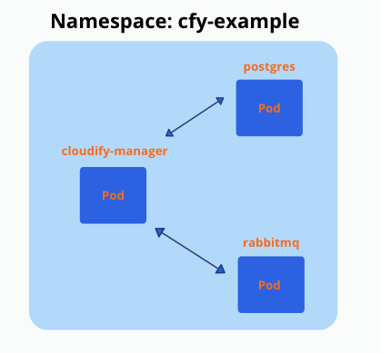

# Cloudify manager AIO helm chart ( Community version )

## Description

It's a helm chart for cloudify manager which is:

- Not highly available, has one replica only.
- Has no persistent volume to survive restarts/failures.
- Has all components on board (as part of docker container): Message Broker and DB part of it.

**This is the best and most simple way to make yourself familiar with cloudify, running a Cloudify manager AIO is a matter of minutes**

## Installation

```bash
helm repo add cloudify-helm https://cloudify-cosmo.github.io/cloudify-helm

helm install cloudify-manager-aio cloudify-helm/cloudify-manager-aio
```

To understand all available options AIO cloudify manager chart has, please read [Cloudify AIO Helm chart](cloudify-manager-aio/README.md)

# Cloudify manager worker helm chart ( Premium version )

## Description

It's a helm chart for cloudify manager which is:

- Highly available, can be deployed with multiple replicas, available only when used with NFS Volume. ( Tested with EFS of AWS | FIlestore of GCP | Azure File Storage)
- Use persistent volume to survive restarts/failures.
- Uses DB (PostgreSQL), which may be deployed as a dependency automatically (also possible to use external postgresql).
- Uses Message Brokers (rabbitMQ), which may be deployed as a dependency automatically.

This is how the setup looks after it's deployed to 'cfy-example' namespace (it's possible to have multiple replicas (pods) of cloudify manager):



## How to create and deploy such a setup?

To better understand how to install and configure cloudify manager worker setup please read [Cloudify manager worker helm chart](cloudify-manager-worker/README.md)

## Deployment Examples

[Deployment to Azure](examples/azure/README.md)

[Deployment to GCP](examples/gcp/README.md)

[Deployment to AWS](examples/gcp/README.md)
