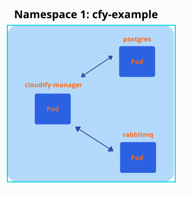

[//]: # (-*- markdown -*-)

# Cloudify manager worker helm chart ( Premium Version )

## Description

It's a helm chart for cloudify manager which:

- Is highly available, can be deployed with multiple replicas. ( available only when used NFS like Storage file system )
- Uses persistent volume to survive restarts/failures.
- Uses DB (PostgreSQL), which may be deployed as a dependency automatically (also possible to use external postgresql).
- Uses Message Brokers (rabbitMQ), which may be deployed as a dependency automatically.

This is how the setup looks after it's deployed to 'cfy-example' namespace (it's possible to have multiple replicas (pods) of cloudify manager):



## Prerequisites

- Docker installed
- Kubectl installed
- Helm installed
- Running Kubernetes cluster (View differences between cloud providers)
  - [EKS on AWS](./../examples/aws/README.md)
  - [AKS on Azure](./../examples/azure/README.md)
  - [GKE on GCP](./../examples/gcp/README.md)
- Sufficient Kubernetes node [Minimum Requirements](https://docs.cloudify.co/latest/install_maintain/installation/prerequisites/)
- Cloudify Premium valid license (for Premium version)

## How to create and deploy such a setup?

1. [Generate certificate as a secret in k8s.](#generate-certificates-and-add-as-secret-to-k8s)

2. [Deployment of Cloudify manager worker with dependencies.](#install-cloudify-manager-worker)

3. [(Optional) Ensure UI access to the manager upon installation](#optional-ensure-ui-access-to-the-manager-upon-installation)

4. [(Optional) Extra configuration options](#configuration-options-of-cloudify-manager-worker-valuesyaml)

5. [Troubleshooting](#troubleshoot)

6. [Uninstallation of helm charts](#uninstallation)

**You need to deploy DB and Message Broker before deploying Cloudify manager worker**

## Generate certificates and add as secret to k8s

**SSL certificate must be provided, to secure communications between cloudify manager and posrgress/rabbitmq**

- ca.crt (to sign other certificates)

- tls.key

- tls.crt

### Option 1: Create certificates using the community cloudify manager docker container

```bash
$ docker pull cloudifyplatform/community-cloudify-manager-aio:latest
$ docker run --name cfy_manager_local -d --restart unless-stopped --tmpfs /run --tmpfs /run/lock cloudifyplatform/community-cloudify-manager-aio
```

Exec to the manager and generate certificates

```bash
$ docker exec -it cfy_manager_local bash

# NAMESPACE to which cloudify-manager deployed, must be changed accordingly
$ cfy_manager generate-test-cert -s 'cloudify-manager-worker.NAMESPACE.svc.cluster.local,rabbitmq.NAMESPACE.svc.cluster.local,postgres-postgresql.NAMESPACE.svc.cluster.local'
```

You can change the name of the created certificates (inside the container):

```bash
$ cd /root/.cloudify-test-ca
$ mv cloudify-manager-worker.helm-update.svc.cluster.local.crt tls.crt
$ mv cloudify-manager-worker.helm-update.svc.cluster.local.key ./tls.key
```

Exit the container and copy the certificates from the container to your working environment:

```bash
$ docker cp cfy_manager_local:/root/.cloudify-test-ca/. ./
```

Create secret in k8s from certificates:

```bash
$ kubectl create secret generic cfy-certs --from-file=./tls.crt --from-file=./tls.key --from-file=./ca.crt -n NAMESPACE
```

### Option 2: Use cert-manager component installed to kubernetes cluster

You need to deploy those manifests, which will generate cfy-certs secret eventually, you need to change NAMESPACE to your namespace before.
You can find this manifest in external folder - cert-issuer.yaml

```yaml
apiVersion: cert-manager.io/v1
kind: Issuer
metadata:
  name: selfsigned-issuer
spec:
  selfSigned: {}
---
apiVersion: cert-manager.io/v1
kind: Certificate
metadata:
  name: cfy-ca
spec:
  secretName: cfy-ca-tls
  commonName: NAMESPACE.svc.cluster.local
  usages:
    - server auth
    - client auth
  isCA: true
  duration: "87660h"
  issuerRef:
    name: selfsigned-issuer
---
apiVersion: cert-manager.io/v1
kind: Issuer
metadata:
  name: cfy-ca-issuer
spec:
  ca:
    secretName: cfy-ca-tls
---
apiVersion: cert-manager.io/v1
kind: Certificate
metadata:
  name: cfy-cert
spec:
  secretName: cfy-certs
  isCA: false
  duration: "87660h"
  usages:
    - server auth
    - client auth
  dnsNames:
    - "postgres-postgresql.NAMESPACE.svc.cluster.local"
    - "rabbitmq.NAMESPACE.svc.cluster.local"
    - "cloudify-manager-worker.NAMESPACE.svc.cluster.local"
    - "postgres-postgresql"
    - "rabbitmq"
    - "cloudify-manager-worker"
  issuerRef:
    name: cfy-ca-issuer
```

Create a local copy of the cert-issuer.yaml and apply it to the namespace:

```bash
$ kubectl apply -f ./cert-issuer.yaml -n NAMESPACE
```

## Clone cloudify-helm repo

This step is necessary because the following steps will require files from this directory

- In case you don't have Git installed - https://github.com/git-guides/install-git

```bash
$ git clone https://github.com/cloudify-cosmo/cloudify-helm.git && cd cloudify-helm
```

## Install cloudify manager worker

### Create secret/configMap with premium license - required if using Cloudify premium version

Create license.yaml file and populate it with license data

```yaml
apiVersion: v1
kind: ConfigMap
metadata:
  name: cfy-license
  namespace: <NAMESPACE>
data:
  cfy_license.yaml: |
    license:
      capabilities: null
      cloudify_version: null
      customer_id: <CUSTOMER_ID>
      expiration_date: 12/31/2021
      license_edition: Premium
      trial: false
    signature: !!binary |
      <LICENSE_KEY>
```

Enable license in values file

- License name (metadata.name) must match the secretName in the values file

```yaml
license:
  secretName: cfy-license
```

Apply created config map:

```bash
$ kubectl apply -f license.yaml
```

### Add the cloudify-helm repo

Add the cloudify-helm chart repo or upgrade it

```bash
$ helm repo add cloudify-helm https://cloudify-cosmo.github.io/cloudify-helm
```

or

```bash
$ helm repo update cloudify-helm
```

**If you want to customize the values it's recommended to do so before installing the chart** - [see configuration options below](#configuration-options-of-cloudify-manager-worker-valuesyaml), and either way make sure to review the values file.

### Enable PostgreSQL and RabbitMQ deployment

For now deploy PostgreSQL and RabbitMQ as dependent subcharts disabled by default for backward compatibility, so for new deployment you need to enable them.

To do that please ensure you have following parameters in the values file:

```yaml
postgresql:
  deploy: true

rabbitmq:
  deploy: true
```

### (optional) If you want to use k8s secrets for store passwords

#### PostgreSQL initial password

Create k8s secret:

```bash
$ kubectl -n NAMESPACE create secret generic SECRET_NAME --from-literal=postgresql-password='POSTGRESQL_INIT_PASSWORD'
```

Update following parameters in your helm values file:

```yaml
db:
  serverExistingPasswordSecret: "SECRET_NAME"
 
postgresql:
  existingSecret: "SECRET_NAME"
```

#### PostgreSQL application connection password

Create k8s secret:

```bash
$ kubectl -n NAMESPACE create secret generic SECRET_NAME --from-literal=postgresql-cloudify-password='POSTGRESQL_CLOUDIFY_PASSWORD'
```

Update following parameters in your helm values file:

```yaml
db:
  cloudifyExistingPassword:
	secret: "SECRET_NAME"
```

#### RabitMQ password

Create k8s secret:

```bash
$ kubectl -n NAMESPACE create secret generic SECRET_NAME --from-literal=rabbitmq-password='RABBITMQ_PASSWORD'
```

Update following parameters in your helm values file:

```yaml
queue:
  existingPasswordSecret: "SECRET_NAME"
 
rabbitmq:
  auth:
    existingPasswordSecret: "SECRET_NAME"
```

#### Cloudify Manager worker admin password

Create k8s secret:

```bash
$ kubectl -n NAMESPACE create secret generic SECRET_NAME --from-literal=cfy-admin-password='CLOUDIFY_ADMIN_PASSWORD'
```

Update following parameters in your helm values file:

```yaml
config:
  security:
    existingAdminPassword:
      secret: "SECRET_NAME"
```

### (optional) Ensure UI access to the manager upon installation

### **[OPTION 1]**

Use ingress-controller (e.g. NGINX Ingress Controller - https://kubernetes.github.io/ingress-nginx/deploy/)

**HTTP**

- Modify Ingress section accordingly (see example):
  ```yaml
  ingress:
    enabled: true
    host: cloudify-manager.DOMAIN
    annotations:
      kubernetes.io/ingress.class: nginx
      nginx.ingress.kubernetes.io/proxy-body-size: 50m # use this annotation to allow upload of resources up to 50mb (e.g. plugins)
      # cert-manager.io/cluster-issuer: "letsencrypt-prod" # use this annotation to utilize an installed cert-manager
    tls:
      enabled: false
      secretName: cfy-secret-name
  ```
  **HTTPS - Pre-applied SSL Cert**
- Create SSL secret with tls certificate
  ```yaml
  apiVersion: v1
  kind: Secret
  metadata:
    name: cfy-secret-name
    namespace: NAMESPACE
  data:
    tls.crt: SSL_TLS_CRT
    tls.key: SSL_TLS_KEY
  type: kubernetes.io/tls
  ```
- Modify Ingress section accordingly (see example):
  ```yaml
  ingress:
    enabled: true
    host: cloudify-manager.DOMAIN
    annotations:
      kubernetes.io/ingress.class: nginx
      nginx.ingress.kubernetes.io/proxy-body-size: 50m # use this annotation to allow upload of resources up to 50mb (e.g. plugins)
      # cert-manager.io/cluster-issuer: "letsencrypt-prod" # use this annotation to utilize an installed cert-manager
    tls:
      enabled: true
      secretName: cfy-secret-name
  ```
  **HTTPS - Certificate Manager**
- Use certificate manager (e.g. Let's Encrypt via cert-manager - https://cert-manager.io/docs/)
- Modify Ingress section accordingly (see example):
  ```yaml
  ingress:
    enabled: true
    host: cloudify-manager.DOMAIN
    annotations:
      kubernetes.io/ingress.class: nginx
      nginx.ingress.kubernetes.io/proxy-body-size: 50m # use this annotation to allow upload of resources up to 50mb (e.g. plugins)
      cert-manager.io/cluster-issuer: "<cluster-issuer-name>" # use this annotation to utilize an installed cert-manager
    tls:
      enabled: true
      secretName: cfy-secret-name
  **HTTP/HTTPS options will expose Cloudify Manager UI on a URL matching the `host` value**
  ```

### **[OPTION 2]**

Skip Ingress and expose the Cloudify Manager service using LoadBalancer.

To have a fixed URL, you must utilize a DNS service to route the LB URL (hostname) to the URL you want.

**HTTP**

For this method you need to edit the Service section to use the right type:

```yaml
service:
  host: cloudify-manager-worker
  type: LoadBalancer
  name: cloudify-manager-worker
  http:
    port: 80
  https:
    port: 443
  internal_rest:
    port: 53333
```

That will create a load balancer depending on your K8S infrastructure (e.g. EKS will create a Classic Load Balancer).

Also please add parameter **config.public_ip** with DNS name which you are going to configure for you Cloudify Manager  load balancer endpoint, for example:

```yaml
config:
  public_ip: cloudify-manager.example.com
```

**To get the hostname of the load balancer run:**

```bash
$ kubectl describe svc/cloudify-manager-worker -n NAMESPACE | grep Ingress
```

Then you can configure DNS record (ALIAS type), points to this load balancer hostname.

**The value of the ingress will be the UI URL of the Cloudify Manager.**

**HTTPS**

- To secure the site with SSL you can update the load balancer configuration to utilize an SSL Certificate

### After values are verified, install the manager worker chart

```bash
$ helm install cloudify-manager-worker cloudify-helm/cloudify-manager-worker --version 0.4.0 -f ./cloudify-manager-worker/values.yaml -n NAMESPACE
```

## Configuration options of cloudify-manager-worker values.yaml

| Key | Type | Default | Description |
|-----|------|---------|-------------|
| additionalSecrets | object | `{}` | Additional secrets to mount on the manager worker pod, make sure the 'name' is also the secret name in the cluster. uncomment secrets and define your mounts More than one secret can be added and more than one mount+sub Path can defined for each secret. (below is an example), . secrets need to be base64 encoded |
| config | object | object | Parameters group for Cloudify Manager configuration |
| config.after_bash | string | `""` | bash commands for execute after main startup script |
| config.caCertPath | string | `"/mnt/cloudify-data/ssl/ca.crt"` | Path to CA certificate. |
| config.cliLocalProfileHostName | string | `"localhost"` | "manager.cli_local_profile_host_name" parameter from Cloudify Manager config.yaml file. |
| config.labels | object | `{}` | Add labels to Manager-worker container (see example below).   example-label: "cloudify-example" |
| config.mgmtWorkerCount | int | `8` | Maximum number of worker processes started by the management worker. |
| config.private_ip | string | `nil` | "manager.private_ip" parameter from Cloudify Manager config.yaml file. If is not set, will be calculated automatically. |
| config.public_ip | string | `nil` | "manager.public_ip" parameter from Cloudify Manager config.yaml file. If is not set, will be calculated automatically. |
| config.replicas | int | `1` | Replicas count for launch. Multiple replicas works only with NFS like volume. |
| config.security.adminPassword | string | `"admin"` | Initial admin password for Cloudify Manager. |
| config.security.existingAdminPassword.key | string | `"cfy-admin-password"` | Name of existing k8s secret key with initial password for Cloudify Manager admin user. |
| config.security.existingAdminPassword.secret | string | `""` | Name of existing k8s secret with initial password for Cloudify Manager admin user. If not empty, existing secret will be used instead of config.security.adminPassword parameter. |
| config.security.sslEnabled | bool | `false` | Enable SSL for Cloudify Manager. |
| config.startDelay | int | `0` | Delay before Cloudify Manager start, in seconds |
| config.tlsCertPath | string | `"/mnt/cloudify-data/ssl/tls.crt"` | Path to TLS certificate. |
| config.tlsKeyPath | string | `"/mnt/cloudify-data/ssl/tls.key"` | Path to TLS certificate key. |
| config.userConfig.loginHint | bool | `true` | Enable initial login password hint. |
| config.userConfig.maxBodySize | string | `"2gb"` | Maximum manager forwarded request size. |
| config.workerCount | int | `4` | Cloudify Manager worker count. Suggested worker count for 1vcpu manager, add more if using a stronger host |
| containerSecurityContext | object | object | Parameters group for k8s containers security context |
| db | object | object | Parameters group for connection to PostgreSQL database |
| db.cloudifyDBName | string | `"cloudify_db"` | Database name for store Cloudify Manager data |
| db.cloudifyExistingPassword.key | string | `"postgresql-cloudify-password"` | Name of existing k8s secret key with PostgreSQL application connection password. |
| db.cloudifyExistingPassword.secret | string | `""` | Name of existing k8s secret with PostgreSQL application connection password. If not empty, existing secret will be used instead of db.cloudifyPassword parameter. |
| db.cloudifyPassword | string | `"cloudify"` | Password for DB connection |
| db.cloudifyUsername | string | `"cloudify"` | Username for DB connection |
| db.host | string | `"postgres-postgresql"` | PostgreSQL connection host. If db.useExternalDB == true this value should contain FQDN, otherwise hostname without k8s domain. |
| db.postgresqlSslClientVerification | bool | `true` | Enable PostgreSQL client SSL certificate verification. |
| db.serverDBName | string | `"postgres"` | Database name for initial connection |
| db.serverExistingPasswordSecret | string | `""` | Name of existing k8s secret with PostgreSQL initial connection password (must contain a value for `postgresql-password` key). If not empty, existing secret will be used instead of db.serverPassword parameter. |
| db.serverPassword | string | `"cfy_test_pass"` | Password for initial DB connection |
| db.serverUsername | string | `"postgres"` | Username for initial DB connection |
| db.useExternalDB | bool | `false` | When switched to true, it will take the FQDN for the pgsql database in host, and require CA cert in secret inputs under TLS section |
| fullnameOverride | string | `"cloudify-manager-worker"` |  |
| image | object | object | Parameters group for Docker images |
| image.pullPolicy | string | `"IfNotPresent"` | Specify a imagePullPolicy, Defaults to 'Always' if image tag is 'latest', else set to 'IfNotPresent'. ref: http://kubernetes.io/docs/user-guide/images/#pre-pulling-images |
| image.pullSecrets | list | `[]` | Optionally specify an array of imagePullSecrets. Secrets must be manually created in the namespace. ref: https://kubernetes.io/docs/tasks/configure-pod-container/pull-image-private-registry/ |
| image.repository | string | `"cloudifyplatform/premium-cloudify-manager-worker"` | Docker image repository |
| image.tag | string | `"6.4.0"` | Docker image tag |
| ingress | object | object | Parameters group for ingress (managed external access to service) |
| ingress.annotations | object | object | Ingress annotation object. Please see an example in values.yaml file |
| ingress.enabled | bool | `false` | Enable ingress |
| ingress.host | string | `"cfy-efs-app.eks.cloudify.co"` | Hostname for ingress connection |
| ingress.tls | object | object | Ingress TLS parameters |
| ingress.tls.enabled | bool | `false` | Enabled TLS connections for Ingress |
| ingress.tls.secretName | string | `"cfy-secret-name"` | k8s secret name with TLS certificates for ingress |
| initContainers | object | object | Parameters group for init containers |
| initContainers.prepareConfigs.pullPolicy | string | `"IfNotPresent"` | imagePullPolicy for prepare-configs init container |
| initContainers.prepareConfigs.repository | string | `"busybox"` | Docker image repository for prepare-configs init container |
| initContainers.prepareConfigs.resources | object | object | resources requests and limits for prepare-configs init container |
| initContainers.prepareConfigs.resources.requests | object | `{"cpu":0.1,"memory":"50Mi"}` | requests for prepare-configs init container |
| initContainers.prepareConfigs.tag | string | `"1.34.1-uclibc"` | Docker image tag for prepare-configs init container |
| initContainers.waitDependencies.enabled | bool | `true` | Enable wait-for-dependencies init container |
| initContainers.waitDependencies.pullPolicy | string | `"IfNotPresent"` | imagePullPolicy for wait-for-dependencies init container |
| initContainers.waitDependencies.repository | string | `"busybox"` | Docker image repository for wait-for-dependencies init container |
| initContainers.waitDependencies.resources | object | object | resources requests and limits for wait-for-dependencies init container |
| initContainers.waitDependencies.resources.requests | object | `{"cpu":0.1,"memory":"50Mi"}` | requests for wait-for-dependencies init container |
| initContainers.waitDependencies.tag | string | `"1.34.1-uclibc"` | Docker image tag for wait-for-dependencies init container |
| initContainers.waitDependencies.timeout | string | `"10m"` | timeout for waiting when all dependencies up |
| license | object | `{}` | Can contain "secretName" field with existing license in k8s configMap, to use Secret instead, set useSecret to true. |
| livenessProbe | object | object | Parameters group for pod liveness probe |
| livenessProbe.enabled | bool | `true` | Enable liveness probe |
| livenessProbe.failureThreshold | int | `8` | liveness probe failure threshold |
| livenessProbe.httpGet.path | string | `"/api/v3.1/ok"` | liveness probe HTTP GET path |
| livenessProbe.httpGet.port | int | `80` | liveness probe HTTP port |
| livenessProbe.initialDelaySeconds | int | `600` | liveness probe initial delay in seconds |
| livenessProbe.periodSeconds | int | `30` | liveness probe period in seconds |
| livenessProbe.successThreshold | int | `1` | liveness probe success threshold |
| livenessProbe.timeoutSeconds | int | `15` | liveness probe timeout in seconds |
| mainConfig | string | `"manager:\n  private_ip: {{ include \"cloudify-manager-worker.private_ip\" . }}\n  public_ip: {{ include \"cloudify-manager-worker.public_ip\" . }}\n  hostname: {{ .Values.service.host }}.{{.Release.Namespace}}.svc.cluster.local\n  cli_local_profile_host_name: {{ .Values.config.cliLocalProfileHostName }}\n  security:\n    ssl_enabled: {{ .Values.config.security.sslEnabled }}\n    admin_password: {{ include \"cloudify-manager-worker.CfyAdminPassword\" . }}\n  {{- if .Values.license }}\n  cloudify_license_path: /tmp/cloudify/cfy_license.yaml\n  {{- end }}\n  cluster_filesystem_replication: false\ncli:\n  local_profile_host_name: {{ .Values.config.cliLocalProfileHostName }}\nrabbitmq:\n  username: {{ .Values.queue.username }}\n  password: {{ include \"cloudify-manager-worker.rabbitmqPassword\" . }}\n  ca_path: {{ .Values.config.caCertPath }}\n  cert_path: {{ .Values.config.tlsCertPath }}\n  key_path: {{ .Values.config.tlsKeyPath }}\n  is_external: true\n  cluster_members:\n    rabbit1:\n      networks:\n        default: {{ .Values.queue.host }}.{{.Release.Namespace}}.svc.cluster.local\npostgresql_client:\n  {{- if .Values.db.useExternalDB }}\n  host: {{ .Values.db.host }}\n  {{- else }}\n  host: {{ .Values.db.host }}.{{.Release.Namespace}}.svc.cluster.local\n  {{- end }}\n  server_db_name: {{ .Values.db.serverDBName }}\n  server_username: {{ .Values.db.serverUsername }}\n  server_password: {{ include \"cloudify-manager-worker.postgresServerPassword\" . }}\n  cloudify_db_name: {{ .Values.db.cloudifyDBName }}\n  cloudify_username: {{ .Values.db.cloudifyUsername }}\n  cloudify_password: {{ include \"cloudify-manager-worker.postgresCloudifyPassword\" . }}\n  {{- if .Values.db.useExternalDB }}\n  ca_path: /mnt/cloudify-data/ssl/postgres_ca.crt\n  {{- else }}\n  ca_path: {{ .Values.config.caCertPath }}\n  {{- end }}\n  ssl_enabled: true\n  ssl_client_verification: {{ .Values.db.postgresqlSslClientVerification }}\npostgresql_server:\n  postgres_password: {{ include \"cloudify-manager-worker.postgresServerPassword\" . }}\n  {{- if .Values.db.useExternalDB }}\n  ca_path: /mnt/cloudify-data/ssl/postgres_ca.crt\n  {{- if ne .Values.tls.pgsqlSslCertName \"\" }}\n  cert_path: /mnt/cloudify-data/ssl/postgres.crt\n  {{- end }}\n  {{- if ne .Values.tls.pgsqlSslKeyName \"\" }}\n  key_path: /mnt/cloudify-data/ssl/postgres.key\n  {{- end }}\n  {{- else }}\n  ca_path: {{ .Values.config.caCertPath }}\n  cert_path: {{ .Values.config.tlsCertPath }}\n  key_path: {{ .Values.config.tlsKeyPath }}\n  {{- end }}\nprometheus:\n  ca_path: {{ .Values.config.caCertPath }}\n  cert_path: {{ .Values.config.tlsCertPath }}\n  key_path: {{ .Values.config.tlsKeyPath }}\n  scrape_interval: 5s\nssl_inputs:\n  {{- if .Values.db.useExternalDB }}\n  postgresql_ca_cert_path: /mnt/cloudify-data/ssl/postgres_ca.crt\n  {{- if ne .Values.tls.pgsqlSslCertName \"\" }}\n  postgresql_client_cert_path: /mnt/cloudify-data/ssl/postgres.crt\n  {{- else }}\n  postgresql_client_cert_path: {{ .Values.config.tlsCertPath }}\n  {{- end }}\n  {{- if ne .Values.tls.pgsqlSslKeyName \"\" }}\n  postgresql_client_key_path: /mnt/cloudify-data/ssl/postgres.key\n  {{- else }}\n  postgresql_client_key_path: {{ .Values.config.tlsKeyPath }}\n  {{- end }}\n  {{- else }}\n  postgresql_ca_cert_path: {{ .Values.config.caCertPath }}\n  postgresql_client_cert_path: {{ .Values.config.tlsCertPath }}\n  postgresql_client_key_path: {{ .Values.config.tlsKeyPath }}\n  {{- end }}\n  ca_cert_path: {{ .Values.config.caCertPath }}\n  internal_cert_path: {{ .Values.config.tlsCertPath }}\n  internal_key_path: {{ .Values.config.tlsKeyPath }}\n  external_cert_path: {{ .Values.config.tlsCertPath }}\n  external_key_path: {{ .Values.config.tlsKeyPath }}\n  external_ca_cert_path: {{ .Values.config.caCertPath }}\ncomposer:\n  # If set to true, Cloudify Composer will not be installed\n  skip_installation: false\nrestservice:\n  gunicorn:\n    worker_count: {{ .Values.config.workerCount }}\nmgmtworker:\n  max_workers: {{ .Values.config.mgmtWorkerCount }}\nvalidations:\n  skip_validations: true\nsanity:\n  skip_sanity: true\nservices_to_install:\n- manager_service\n- monitoring_service\nservice_management: supervisord\n"` | Content of the main configuration file for cloudify manager (config.yaml). @default -- |
| nameOverride | string | `"cloudify-manager-worker"` |  |
| nodeSelector | object | `{}` | Node labels for default backend pod assignment. Ref: https://kubernetes.io/docs/user-guide/node-selection/ |
| okta | object | object | Parameters group for OKTA |
| okta.certPath | string | `""` | SSL certificate path |
| okta.enabled | bool | `false` | Enable OKTA support. |
| okta.portalUrl | string | `""` | Portal URL |
| okta.secretName | string | `"okta-license"` | k8s secret name containing the OKTA certificates. |
| okta.ssoUrl | string | `""` | SSO URL |
| podSecurityContext | object | object | Parameters group for k8s pod security context |
| postgresql | object | object | Parameters group for bitnami/postgresql helm chart. Details: https://github.com/bitnami/charts/blob/main/bitnami/postgresql/README.md |
| queue | object | object | Parameters group for connection to RabbitMQ (Message Broker) |
| queue.existingPasswordSecret | string | `""` | Name of existing k8s secret with RabbitMQ password (must contain a value for `rabbitmq-password` key). If not empty, existing secret will be used instead of queue.password parameter. |
| queue.host | string | `"rabbitmq"` | RabbitMQ connection host (without k8s domain) |
| queue.password | string | `"cfy_test_pass"` | Password for connection to RabbitMQ |
| queue.username | string | `"cfy_user"` | Username for connection to RabbitMQ |
| rabbitmq | object | object | Parameters group for bitnami/rabbitmq helm chart. Details: https://github.com/bitnami/charts/blob/main/bitnami/rabbitmq/README.md |
| readinessProbe | object | object | Parameters group for pod readiness probe |
| readinessProbe.enabled | bool | `true` | Enable readiness probe |
| readinessProbe.failureThreshold | int | `5` | readiness probe failure threshold |
| readinessProbe.httpGet.path | string | `"/console"` | readiness probe HTTP GET path |
| readinessProbe.httpGet.port | int | `80` | readiness probe HTTP port |
| readinessProbe.initialDelaySeconds | int | `0` | readiness probe initial delay in seconds |
| readinessProbe.periodSeconds | int | `10` | readiness probe period in seconds |
| readinessProbe.successThreshold | int | `1` | readiness probe success threshold |
| readinessProbe.timeoutSeconds | int | `5` | readiness probe timeout in seconds |
| resources | object | object | Parameters group for resources requests and limits |
| resources.limits | object | `{"cpu":3,"memory":"4.5Gi"}` | resources limits for Cloudify Manager container |
| resources.requests | object | `{"cpu":0.5,"memory":"2Gi"}` | resources requests for Cloudify Manager container |
| service | object | object | Parameters group for k8s service |
| service.extraPorts | object | `{}` | k8s service additional ports. If you need to open additional ports for the manager, uncomment extraPorts and define your port parameters - More than one can be added (below is an example). |
| service.host | string | `"cloudify-manager-worker"` | k8s service host |
| service.http.port | int | `80` | k8s service http port |
| service.https.port | int | `443` | k8s service https port |
| service.internalRest.port | int | `53333` | k8s service internal rest port |
| service.name | string | `"cloudify-manager-worker"` | k8s service name |
| service.type | string | `"ClusterIP"` | k8s service type |
| startupProbe | object | object | Parameters group for pod startup probe |
| startupProbe.enabled | bool | `true` | Enable startup probe |
| startupProbe.failureThreshold | int | `30` | startup probe failure threshold |
| startupProbe.httpGet.path | string | `"/console"` | startup probe HTTP GET path |
| startupProbe.httpGet.port | int | `80` | startup probe HTTP port |
| startupProbe.initialDelaySeconds | int | `30` | startup probe initial delay in seconds |
| startupProbe.periodSeconds | int | `10` | startup probe period in seconds |
| startupProbe.successThreshold | int | `1` | startup probe success threshold |
| startupProbe.timeoutSeconds | int | `5` | startup probe timeout in seconds |
| tls.pgsqlSslCaName | string | `"postgres_ca.crt"` | subPath name for ssl CA cert in k8s secret. Required only for connection to external PostgreSQL database. |
| tls.pgsqlSslCertName | string | `""` | subPath name for ssl certificate in k8s secret for connection to external PostgreSQL database. Isn't required if db.postgresqlSslClientVerification = false. |
| tls.pgsqlSslKeyName | string | `""` | subPath name for ssl key in k8s secret for connection to external PostgreSQL database. Isn't required if db.postgresqlSslClientVerification = false. |
| tls.pgsqlSslSecretName | string | `"pgsql-external-cert"` | k8s secret name with ssl certificates for external PostgreSQL database. Required only for connection to external PostgreSQL database. |
| tls.secretName | string | `"cfy-certs"` | k8s secret name with certificates to secure communications between cloudify manager and postgresql|rabbitmq deployed inside the same k8s cluster. |
| userConfig | string | `"{\n  \"maps\": {\n    \"tilesUrlTemplate\": \"https://tiles.stadiamaps.com/tiles/osm_bright/${z}/${x}/${y}${r}.png?api_key=${accessToken}\",\n    \"attribution\": \"&copy; <a href=\\\"https://stadiamaps.com/\\\">Stadia Maps</a>, &copy; <a href=\\\"https://openmaptiles.org/\\\">OpenMapTiles</a> &copy; <a href=\\\"http://openstreetmap.org\\\">OpenStreetMap</a> contributors\"\n  },\n  \"proxy\": {\n    \"timeouts\": {\n      \"get\": 30000,\n      \"post\": 30000,\n      \"put\": 30000,\n      \"delete\": 10000\n    },\n    \"maxBodySize\": \"{{ .Values.config.userConfig.maxBodySize | default \"2gb\" }}\"\n  },\n  \"saml\": {\n    \"enabled\": {{ .Values.okta.enabled }},\n    \"certPath\": \"{{ .Values.okta.certPath }}\",\n    \"ssoUrl\": \"{{ .Values.okta.ssoUrl }}\",\n    \"portalUrl\": \"{{ .Values.okta.portalUrl }}\"\n  },\n  \"whiteLabel\": {\n    \"logoUrl\": \"\",\n    \"mainColor\": \"#0077FC\",\n    \"headerTextColor\": \"white\",\n    \"showVersionDetails\": true,\n    \"showFirstLoginHint\": {{ .Values.config.userConfig.loginHint }},\n    \"loginPageHeaderColor\": \"white\",\n    \"loginPageTextColor\": \"white\",\n    \"sidebarColor\": \"#050229\",\n    \"sidebarTextColor\" : \"white\",\n    \"sidebarHoverActiveColor\": \"#1e1a3d\",\n    \"sidebarHoverActiveTextColor\": \"#65adff\",\n    \"customCssPath\": \"\"\n  },\n  \"widgets\": {\n    \"allowedModules\": [\"lodash\", \"body\", \"elkjs\"]\n  }\n}\n"` | Content of the userConfig.json configuration file @default -- |
| volume | object | object | Parameters group for data storage volume For multiple replicas of cloudify manager use NFS like storage, storageClass: 'cm-efs' (AWS example), accessMode: 'ReadWriteMany' Single replica - EBS (AWS example), storageClass: 'gp2' (AWS example), accessMode: 'ReadWriteOnce' |
| volume.accessMode | string | `"ReadWriteOnce"` | volume access mode |
| volume.size | string | `"3Gi"` | volume size |
| volume.storageClass | string | `"gp2"` | volume storage class |

Edit the values file in `./cloudify-manager-worker/values.yaml` according to your preferences:

### Upgrade cloudify manager worker

To upgrade cloudify manager use 'helm upgrade'.

For example to change to newer version (e.g. from 6.2.0 to 6.3.0 in this example),

Change image version in values.yaml:

Before:

```yaml
image:
  repository: cloudifyplatform/premium-cloudify-manager-worker
  tag: 6.2.0
```

After:

```yaml
image:
  repository: cloudifyplatform/premium-cloudify-manager-worker
  tag: 6.3.0
```

Run 'helm upgrade'

```bash
$ helm upgrade cloudify-manager-worker cloudify-helm/cloudify-manager-worker -f ./cloudify-manager-worker/values.yaml -n NAMESPACE
```

If DB schema was changed in newer version, needed migration will be running first on DB, then application will be restarted during upgrade - be patient, because it may take a couple of minutes.

### Image:

```yaml
image:
  repository: "cloudifyplatform/premium-cloudify-manager-worker"
  tag: "6.3.0"
  pullPolicy: IfNotPresent
```

### DB - postgreSQL:

```yaml
db:
  useExternalDB: false # when switched to true, it will take the FQDN for the pgsql database in host, and require CA cert in secret inputs under TLS section
  postgresqlSslClientVerification: true
  host: postgres-postgresql
  cloudify_db_name: "cloudify_db"
  cloudify_username: "cloudify"
  cloudify_password: "cloudify"
  server_db_name: "postgres"
  server_username: "postgres"
  server_password: "cfy_test_pass"
```

### Message Broker - rabbitmq:

```yaml
queue:
  host: rabbitmq
  username: "cfy_user"
  password: "cfy_test_pass"
```

### Service:

[See customization example above](#option-2)

```yaml
service:
  host: cloudify-manager-worker
  type: ClusterIP
  name: cloudify-manager-worker
  http:
    port: 80
  https:
    port: 443
  internal_rest:
    port: 53333
```

### node selector - select on which nodes cloudify manager may run:

```yaml
nodeSelector: {}
# nodeSelector:
#   nodeType: onDemand
```

### Secrets for TLS/SSL certificates

```yaml
tls:
  # certificates as a secret, to secure communications between cloudify manager and postgress|rabbitmq
  secretName: cfy-certs
  # Parameters for PostgreSQL SSL certificates, required for external postgresql database only
  pgsqlSslSecretName: pgsql-external-cert # k8s secret name with psql ssl certs
  pgsqlSslCaName: postgres_ca.crt # subPath name for ssl CA cert in k8s secret
  pgsqlSslCertName: '' # subPath name for ssl cert in k8s secret, isn't required
  pgsqlSslKeyName: '' # subPath name for ssl key in k8s secret, isn't required
```

### Additional secrets to mount onto cloudify-manager-worker pod

In case you need to mount additional secrets to the pod (e.g. self-signed certificate for 3rd party connection)
For each secret you need to define its mounts. It's possible to mounts several files under one secret definition using different subPaths
See below or example in the values file.

```yaml
additionalSecrets:
  - name: secretName
    mounts:
      - mountPath: /mnt/cloudify-data/ssl/secretName.crt
        subPath: secretName.crt
      - mountPath: /mnt/cloudify-data/ssl/secretName.key
        subPath: secretName.key
```

### resources requests and limits:

```yaml
resources:
  requests:
    memory: 0.5Gi
    cpu: 0.5
```

### Persistent volume size for EBS/EFS:

If using multiple replicas (High availability), NFS like Storage like EFS must be used.
For more details see links to different cloud providers [here](#prerequisites)

```yaml
volume:
  storage_class: "efs"
  access_mode: "ReadWriteMany"
  size: "3Gi"
```

If using one replicas, you can use EBS (gp2) for example, **gp2 is default**:

```yaml
volume:
  storage_class: "gp2"
  access_mode: "ReadWriteOnce"
  size: "3Gi"
```

### readiness probe may be enabled/disabled

```yaml
readinessProbe:
  enabled: true
  port: 80
  path: /console
  initialDelaySeconds: 10
```

### Config

You can delay start of cfy manager / install all plugins / disable security (not recommended)...

```yaml
config:
  start_delay: 0
  # Multiple replicas works only with EFS(NFS) volume
  replicas: 1
  install_plugins: false
  cli_local_profile_host_name: localhost
  security:
    ssl_enabled: false
    admin_password: admin
  tls_cert_path: /mnt/cloudify-data/ssl/tls.crt
  tls_key_path: /mnt/cloudify-data/ssl/tls.key
  ca_cert_path: /mnt/cloudify-data/ssl/ca.crt
```

### Ingress

You may enable ingress-nginx and generate automatically cert if you have ingress-nginx / cert-manager installed (e.g. using nginx with existing ssl secret) - [See above for more details](#option-1)

```yaml
ingress:
  enabled: false
  host: cloudify-manager.app.cloudify.co
  annotations:
    kubernetes.io/ingress.class: nginx
    nginx.ingress.kubernetes.io/proxy-body-size: 50m # use this annotation to allow upload of resources up to 50mb (e.g. plugins)
    # cert-manager.io/cluster-issuer: "letsencrypt-prod" # use this annotation to utilize an installed cert-manager
  tls:
    enabled: false
    secretName: cfy-secret-name
```

### Create secret for okta-license - required if using Okta/SSO

First obtain the okta/sso server certificate and store it in a file for exanple okta_certificate.pem

```bash
echo -n '-----BEGIN CERTIFICATE-----
MIIDXDCCAkSgAwIBAgIJAKwO13ndNBPjMA0GCSqGSIb3DQEBCwUAMCkxJzAlBgNV
BAMMHkNsb3VkaWZ5IGdlbmVyYXRlZCBjZXJ0aWZpY2F0ZTAeFw0yMTA2MTQxMjMx
NDZaFw0zMTA2MTIxMjMxNDZaMCYxJDAiBgNVBAMMG2lwLTEwLTEwLTQtMTE2LmVj
-----END CERTIFICATE-----'  > ./okta_certificate.pem
```

then let's create the okta-license secret in the NAMESPACE

```bash
kubectl create secret generic okta-license --from-file=./okta_certificate.pem -n NAMESPACE
```

## Troubleshoot

Some common use cases:

### License is not uploaded correctly upon installation

[deprecated] This might happen if the English convention of licence/license is not alligned across the values (name of the value and its value), or across the license/licence configMap.

Since v0.4.1 `licence` convention is not supported. please use `license`.

The [StatefulSet](./templates/statefulset.yaml) accepts a [secret/configMap](#create-secret/configmap-with-premium-license---required-if-using-cloudify-premium-version) with the `data` value of this syntax `cfy_license.yaml`

After ensuring the above, try to reinstall the worker chart

- Workaround for this issue would be to manually upload the license after the manager installation through the UI after logging in or via the [CLI](https://docs.cloudify.co/latest/cli/maint_cli/license/).

### Cloudify Manager installation succeded but I can't reach the UI

Please see [above](#optional-ensure-ui-access-to-the-manager-upon-installation)

If you already installed the chart, update the values accordingly and run:

```bash
$ helm upgrade cloudify-manager-worker cloudify-helm/cloudify-manager-worker -f <path-to-values.yaml-file> -n NAMESPACE
```

### I had to reinstall the worker chart and now it fails on installation

This might happen due to inter-communications between the components in the different pods, a work around for that would be to delete the postgresql (has a PersistentVolume) and the rabbitmq pods, which will trigger a restart for them.

```bash
$ kubectl delete pod postgres-postgresql-0 -n NAMESPACE
$ kubectl delete pod rabbitmq-0 -n NAMESPACE
```

Then try reinstalling the worker chart.

### Can't find the help you need here?

Feel free to open an [issue](https://github.com/cloudify-cosmo/cloudify-helm/issues) in the helm chart GitHub page, or [contact us](https://cloudify.co/contact/) through our website.

## Uninstallation

Uninstall helm release:

```bash
$ helm uninstall cloudify-manager-worker -n NAMESPACE
```

If you want to remove Persistent Volume Claims (for example if you are going to reinstall stack without data saving):

```
kubectl --namespace NAMESPACE delete persistentvolumeclaims cfy-worker-pvc data-postgres-postgresql-0 data-rabbitmq-0
```

To clean the supporting files:

```bash
$ kubectl delete secret cfy-certs -n NAMESPACE
$ kubectl delete configmap cfy-license -n NAMESPACE
```

[Jump to Top](#cloudify-manager-worker-helm-chart--premium-version)
